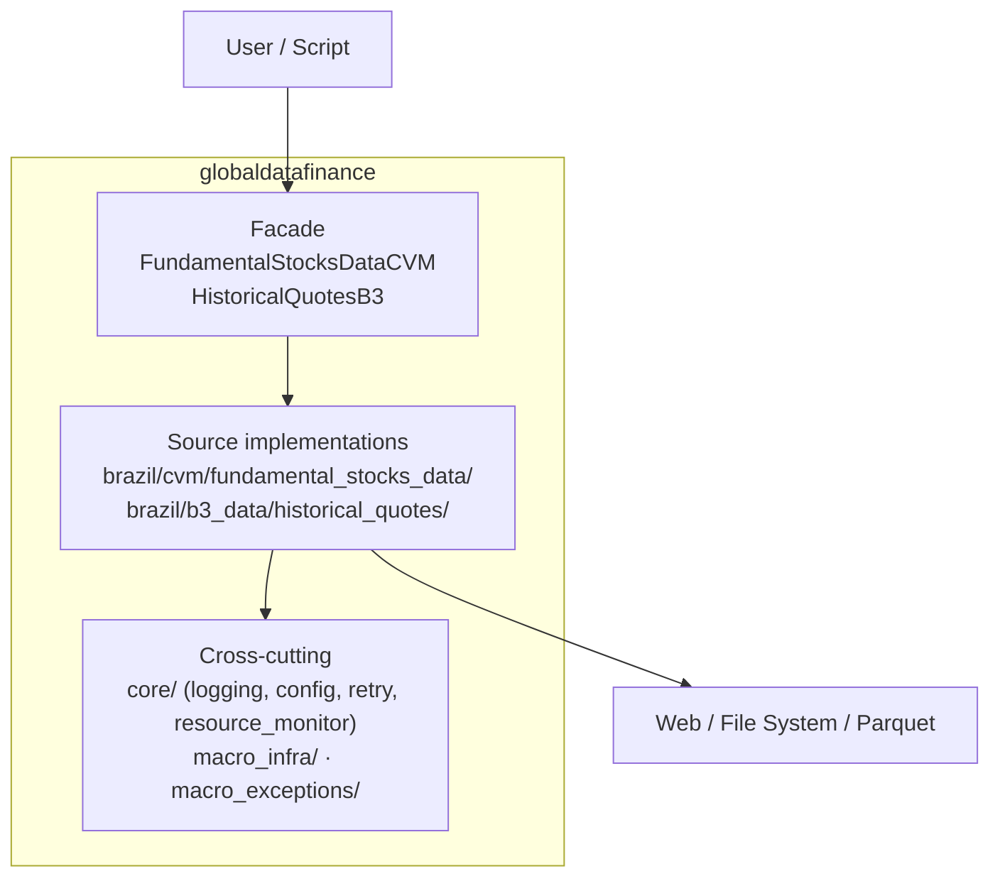

# 📊 Global-Data-Finance

<div align="center">

**Python library for extracting, normalizing, and persisting Brazilian regulatory and market data in Parquet.**

[](https://www.python.org/downloads/)
[](https://pypi.org/project/globaldatafinance/)
[](https://github.com/jordanestralioto/Global-Data-Finance/blob/develop/LICENSE)
[](https://github.com/astral-sh/ruff)
[](http://mypy-lang.org/)

[Official Documentation](https://jordanestralioto.github.io/Global-Data-Finance/) • [Installation](#-installation) • [Quick Start](#-quick-start) • [API Reference](#-api-reference) • [Contributing](CONTRIBUTING.md) • [Security](SECURITY.md) • [Code of Conduct](CODE_OF_CONDUCT.md)

</div>

______________________________________________________________________

## 🎯 About

**Global-Data-Finance** is a Python distribution library for extracting,
normalizing, and persisting Brazilian financial data. The currently implemented
sources are regulatory documents from CVM and historical market quotes from B3.
The public API is designed for developers, data scientists, and quantitative
analysts who need validated source files and Parquet artifacts.

The public API is deliberately narrow: the package root re-exports
`FundamentalStocksDataCVM`, `HistoricalQuotesB3`, and the public
`ExtractionResultB3` `TypedDict`. Source-specific implementations live under
the owning CVM and B3 feature directories, while genuinely shared concerns
live in `core/`, `macro_infra/`, and `macro_exceptions/`.

### 🌟 Why Choose Global-Data-Finance?

- **🚀 Performance**: Async downloads with `httpx[http2]`, custom exponential retry/backoff (`core/utils/retry_strategy.py`), and adaptive concurrency monitored by CPU/RAM (`psutil`).
- **🛡️ Robustness**: Downloaded files are checked for expected size and readable ZIP contents; inputs and paths are validated before extraction or writes, with a failure-atomic CVM batch commit during automatic extraction.
- **💾 Columnar Format**: Canonical output in **Parquet** through `pyarrow`, ready for Pandas or PyArrow consumers.
- **🧩 Source Ownership**: CVM and B3 keep source-specific validation, parsing, orchestration, and I/O in their owning directories; shared behavior is centralized only when it is genuinely generic.
- **✨ Developer Experience**: Complete type hints, structured logging, strict test markers (`unit`, `integration`, `slow`, `asyncio`).

______________________________________________________________________

## ✨ Features

### 📈 Supported Data Sources

| Source  | Data Type            | Details                                                                   | Status        |
| :------ | :------------------- | :------------------------------------------------------------------------ | :------------ |
| **CVM** | Regulatory Documents | DFP, ITR, FRE, FCA, CGVN, VLMO, IPE                                       | ✅ Production |
| **B3**  | Historical Quotes    | Stocks, ETFs, Options, Term, Option exercise, Forward contracts, Auctions | ✅ Production |

### ⚙️ Technical Highlights

- **Asynchronous Download Manager**:
  - Automatic concurrency management.
  - Exponential backoff for network failures.
  - File path, size, and readable-ZIP validation. MD5 checksum support is **Planned** and is not implemented in the current runtime.
- **Quotes Processing (B3)**:
  - Optimized parser for legacy positional files.
  - Execution modes: `fast` (in-memory) and `slow` (low-memory).
  - Advanced filtering by currently supported asset category.

### B3 asset categories

`HistoricalQuotesB3` accepts the following `assets_list` values:

| Canonical API value | Meaning in English                                   | Status       |
| :------------------ | :--------------------------------------------------- | :----------- |
| `ações`             | Stocks, including spot and fractional market records | ✅ Supported |
| `etf`               | Exchange-traded funds                                | ✅ Supported |
| `opções`            | Call and put options                                 | ✅ Supported |
| `termo`             | Term-market contracts                                | ✅ Supported |
| `exercicio_opcoes`  | Options exercise records                             | ✅ Supported |
| `forward`           | Forward contracts (TPMERC 050 and 060)               | ✅ Supported |
| `leilao`            | Auction-market records                               | ✅ Supported |
| BDRs                | Brazilian Depositary Receipts                        | 🗺️ Planned   |
| Futures             | Futures contracts                                    | 🗺️ Planned   |

The Portuguese strings above are canonical API values and must be passed
exactly as shown. Planned features are not supported by the current runtime
contract and must not be passed to the public API.

______________________________________________________________________

## 📊 Measured Performance Baseline

These measurements are regression evidence from a reference environment, not a
fixed-time promise for every machine or dataset.

### B3 local benchmark

Measured on **2026-08-06** with Python 3.13.7, 8 CPUs, and 7.55 GB RAM. The 17
official COTAHIST ZIP files for 2008–2024 were already present locally, so no
network call occurred during the measurement. The scope covered all currently
supported asset categories.

| Mode          | Written rows |    Peak RSS | Elapsed time |
| :------------ | -----------: | ----------: | -----------: |
| **B3 `fast`** |   15,059,876 | 4,259.35 MB |   1,224.64 s |
| **B3 `slow`** |   15,059,876 | 1,570.54 MB |   1,761.91 s |

### CVM end-to-end benchmark

This separate measurement includes CVM downloads, downloaded-file validation,
CSV extraction, and Parquet generation. It is network-dependent, so elapsed
time varies with source availability, bandwidth, and latency.

| Scope                              | ZIPs downloaded | Parquet artifacts | Extracted rows |  Peak RSS | Elapsed time |
| :--------------------------------- | --------------: | ----------------: | -------------: | --------: | -----------: |
| CVM, all document types, 2010–2024 |              88 |             1,392 |     63,300,208 | 459.18 MB |     505.04 s |

### Reproducible synthetic B3 baseline

The synthetic benchmark used 250,000 records and three local runs per mode; it
also made no network calls.

| Mode   | Written rows | Elapsed time (median) |    Peak RSS | Throughput (median) |
| :----- | -----------: | --------------------: | ----------: | ------------------: |
| `fast` |      250,000 |               12.27 s | 1,111.72 MB |    22,427 records/s |
| `slow` |      250,000 |               19.04 s | 1,103.01 MB |    13,847 records/s |

See the full [benchmark methodology and reproduction guide](docs/dev-guide/benchmarks.md).

______________________________________________________________________

## 🚀 Installation

Requires **Python >=3.12,\<4.0**.

### Via Pip (consume as dependency)

```bash
pip install globaldatafinance
```

### Via uv (development)

`uv` is the canonical package manager for the project. To hack locally:

```bash
git clone https://github.com/jordanestralioto/Global-Data-Finance.git
cd Global-Data-Finance
uv sync --locked --all-extras --dev
uv run --locked --no-sync pytest
uv run --locked --no-sync pre-commit install --install-hooks
uv run --locked --no-sync pre-commit run --all-files --show-diff-on-failure
```

______________________________________________________________________

## 💡 Quick Start

### 1. Fundamental Data (CVM)

Download financial statements (DFP, ITR) and reference forms in a massive and resilient way.

```python
from globaldatafinance import FundamentalStocksDataCVM
import logging

# (Optional) Configure logging to view detailed progress
logging.basicConfig(level=logging.INFO)

# Initialize client
cvm = FundamentalStocksDataCVM()

# Download and automatically extract to Parquet
result = cvm.download(
    destination_path="./cvm_data",
    list_docs=["DFP", "ITR"],    # Document types
    initial_year=2023,           # Start year
    last_year=2024,              # End year
    automatic_extractor=True     # Converts ZIP -> Parquet
)
print(f"Successful downloads: {result.success_count_downloads}")
```

### 2. Historical Quotes (B3)

Process locally available B3 historical series and persist the filtered records
as Parquet. The public method returns an `ExtractionResultB3` with operation
status and artifact metadata; it does not return a DataFrame as its primary
contract.

Before extraction, download the annual COTAHIST files from the [official B3
Historical Quotes page](https://www.b3.com.br/pt_br/market-data-e-indices/servicos-de-dados/market-data/historico/mercado-a-vista/cotacoes-historicas/)
and place them in the input directory. The accepted names are
`COTAHIST_A{YYYY}.ZIP` and `COTAHIST_A{YYYY}.TXT`. `path_of_docs` identifies this
existing input directory; the library does not populate it automatically. If
both formats exist for the same year, ZIP takes precedence.

```python
from globaldatafinance import HistoricalQuotesB3

# Initialize client
b3 = HistoricalQuotesB3()

# Extract Stock and ETF quotes
result = b3.extract(
    path_of_docs="./raw_b3_data",  # Existing B3 ZIP/TXT inputs
    destination_path="./processed_data",
    assets_list=["ações", "etf"],
    initial_year=2023,
    processing_mode="fast"  # Optimized mode
)

print(f"Processing completed! Extracted records: {result['total_records']:,}")
print(f"File saved at: {result['output_file']}")
```

### 3. Analyzing Data

Data is saved in **Parquet** format, ideal for analysis with Pandas or PyArrow.

The library no longer installs Polars. Install it independently if it is your
preferred downstream Parquet reader.

```python
import pandas as pd

# Read generated file
df = pd.read_parquet("./processed_data/cotahist_extracted.parquet")

# Analyze
print(df.head())
print(df.groupby("ticker")["preco_fechamento"].mean())
```

______________________________________________________________________

## 🏗️ Architecture

The runtime is organized by ownership and responsibility:

1. **Public facades and application layer (`application/`)** — the SemVer-sensitive boundary exposed to callers, including the two public source facades and console formatters.
2. **Source implementations** — CVM lives in `brazil/cvm/fundamental_stocks_data/`; B3 lives in `brazil/b3_data/historical_quotes/`. Clients and use cases orchestrate operations, adapters own HTTP/filesystem/extraction I/O, and focused modules own validation, parsing, and transformation.
3. **Shared infrastructure** — `core/` contains configuration, logging, path safety, retry, progress, and resource monitoring; `macro_infra/` contains generic HTTP/file adapters; `macro_exceptions/` contains project exception bases.



### Directory Structure

```text
src/
└── globaldatafinance/
    ├── application/                       # Public facades and formatters
    │   ├── cvm_docs/fundamental_stocks_data.py
    │   └── b3_docs/historical_quotes.py
    ├── brazil/
    │   ├── cvm/
    │   │   └── fundamental_stocks_data/   # CVM source implementation
    │   │       ├── core.py · client.py · errors.py
    │   │       ├── http.py · extract.py
    │   │       └── download_validation.py · download_extraction.py
    │   └── b3_data/
    │       └── historical_quotes/         # B3 source implementation
    │           ├── models.py · filesystem.py · assets.py · processing.py · years.py
    │           ├── client.py · zip_reader.py · errors.py
    │           ├── cotahist_parser.py
    │           ├── parquet_writer/        # subpackage (writer/schema/session/...)
    │           └── extraction_service/    # subpackage (service/zip_processor/...)
    ├── core/                              # shared configuration and runtime utilities
    ├── macro_infra/                       # generic HTTP and file adapters
    └── macro_exceptions/                  # project exception bases
```

Details in [`docs/dev-guide/architecture.md`](docs/dev-guide/architecture.md) and [`AGENTS.md`](AGENTS.md).

______________________________________________________________________

## 📊 API Reference

### `FundamentalStocksDataCVM`

Manager for downloading CVM documents.

| Method                    | Signature                                                                                                                                                                               | Description                                                 |
| :------------------------ | :-------------------------------------------------------------------------------------------------------------------------------------------------------------------------------------- | :---------------------------------------------------------- |
| **`download`**            | `(destination_path: str, list_docs: list[str] \| None = None, initial_year: int \| None = None, last_year: int \| None = None, automatic_extractor: bool = False) -> DownloadResultCVM` | Downloads and optionally extracts documents.                |
| **`async_download`**      | `(destination_path: str, list_docs: list[str] \| None = None, initial_year: int \| None = None, last_year: int \| None = None, automatic_extractor: bool = False) -> DownloadResultCVM` | Asynchronous variant of `download`.                         |
| **`get_available_docs`**  | `() -> dict[str, str]`                                                                                                                                                                  | Returns list of available documents and their descriptions. |
| **`get_available_years`** | `() -> AvailableYearsInfoCVM`                                                                                                                                                           | Returns range of available years for download.              |

### `HistoricalQuotesB3`

Extractor for B3 historical quotes.

`extract()` and `extract_async()` return an `ExtractionResultB3` mapping. It
reports `success`, a human-readable `message`, file and record counts, an
`errors` mapping, the selected `assets` and `processing_mode`, `elapsed_time`,
and the `output_file` path. The processed rows are persisted in Parquet; a
DataFrame is not the primary return contract.

| Method                     | Signature                                                                                                                                                                                                                                                                    | Description                                                                                  |
| :------------------------- | :--------------------------------------------------------------------------------------------------------------------------------------------------------------------------------------------------------------------------------------------------------------------------- | :------------------------------------------------------------------------------------------- |
| **`extract`**              | `(path_of_docs: str, assets_list: list[str], initial_year: int \| None = None, last_year: int \| None = None, destination_path: str \| None = None, output_filename: str = "cotahist_extracted", processing_mode: str = "fast", verbose: bool = True) -> ExtractionResultB3` | Processes `COTAHIST_A{YYYY}.ZIP` or `.TXT` inputs and generates a consolidated Parquet file. |
| **`extract_async`**        | `(path_of_docs: str, assets_list: list[str], initial_year: int \| None = None, last_year: int \| None = None, destination_path: str \| None = None, output_filename: str = "cotahist_extracted", processing_mode: str = "fast", verbose: bool = True) -> ExtractionResultB3` | Asynchronous variant of `extract`.                                                           |
| **`get_available_assets`** | `() -> list[str]`                                                                                                                                                                                                                                                            | Returns supported asset types (e.g., 'ações', 'opções').                                     |
| **`get_available_years`**  | `() -> dict[str, int]`                                                                                                                                                                                                                                                       | Returns range of available years for historical data.                                        |

______________________________________________________________________

## 🤝 Contributing

Contributions are very welcome! If you wish to add new data sources, improve performance, or fix bugs:

1. **Fork** the repository.
2. Create a branch for your feature (`git checkout -b feature/new-feature`).
3. Implement your changes.
4. Run tests and linters:
   ```bash
   uv run --locked --no-sync pre-commit run --all-files --show-diff-on-failure
   uv run --locked --no-sync pytest
   ```
5. Open a **Pull Request**.

See the [Contributing Guide](https://jordanestralioto.github.io/Global-Data-Finance/dev-guide/contributing/) for more details.

The repository's quick contribution entry point is
[CONTRIBUTING.md](CONTRIBUTING.md). Security reports must follow
[SECURITY.md](SECURITY.md), and community participation follows the
[Code of Conduct](CODE_OF_CONDUCT.md).

______________________________________________________________________

## 📄 License

This project is distributed under the **Apache 2.0** license. See the [LICENSE](LICENSE) file for more information.

______________________________________________________________________

## 📞 Support and Contact

- **Author**: Jordan Estralioto
- **GitHub**: [@jordanestralioto](https://github.com/jordanestralioto)
- **Email**: estraliotojordan@gmail.com
- **Issues**: [Report Bug](https://github.com/jordanestralioto/Global-Data-Finance/issues)
- **Security**: [Security Policy](SECURITY.md)
- **Community**: [Code of Conduct](CODE_OF_CONDUCT.md)

______________________________________________________________________

<div align="center">
    <sub>Copyright © 2026 Jordan Estralioto • Licensed under Apache 2.0</sub>
</div>
