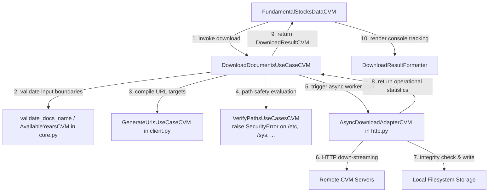
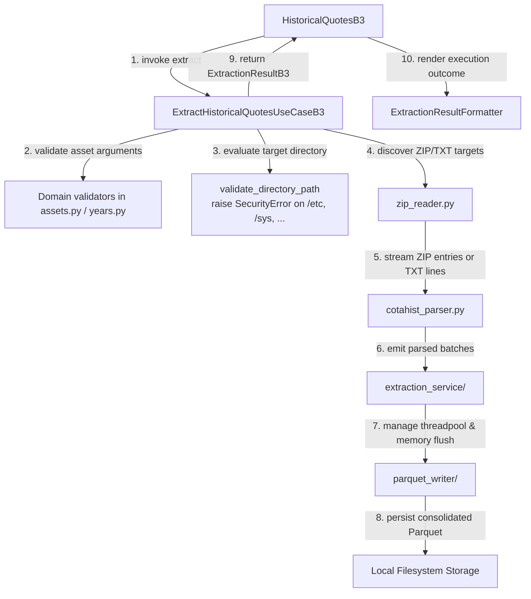

# Architecture

Comprehensive documentation detailing the structural architecture of Global-Data-Finance, foundational design patterns, and internal module organization.

______________________________________________________________________

## Overview

Global-Data-Finance is a Python distribution library whose public API boundary
is deliberately narrow — exposing at the package root the classes
`FundamentalStocksDataCVM` and `HistoricalQuotesB3`, alongside the typed
dictionary contract `ExtractionResultB3`. The currently implemented sources are
Brazilian CVM regulatory feeds and B3 historical market data. Internally, each
source is implemented in its owning feature directory using focused modules and
specialized subpackages where the domain requires them.

This architectural paradigm prioritizes:

- ✅ **Readability**: concise module files with explicit operational roles (CVM: `core.py`, `client.py`, `http.py`, `extract.py`, `errors.py`; B3: role-named modules — `client.py`, `assets.py`, `models.py`, `years.py`, `processing.py`, `filesystem.py`, `errors.py`, supplemented by domain subpackages)
- ✅ **Maintainability**: a clean, concise structure pragmatically aligned with module capabilities and functional boundaries
- ✅ **Extensibility**: integrating a new supported source means defining source-owned modules and a public facade that fit its responsibilities, reusing the CVM or B3 boundaries where appropriate
- ✅ **Testability**: straightforward dependency injection and duck typing to isolate and test components cleanly without ceremony

______________________________________________________________________

## Repository Structure

```text
globaldatafinance/
├── src/globaldatafinance/
│   ├── __init__.py                  # public top-level re-exports
│   ├── application/                 # PUBLIC FACADE LAYER (top-level)
│   │   ├── b3_docs/
│   │   │   ├── historical_quotes.py            # HistoricalQuotesB3
│   │   │   ├── extraction_result_formatter.py
│   │   │   └── result_formatters/
│   │   └── cvm_docs/
│   │       ├── fundamental_stocks_data.py      # FundamentalStocksDataCVM
│   │       └── download_result_formatter.py
│   ├── brazil/                      # SOURCE FEATURE IMPLEMENTATIONS
│   │   ├── b3_data/
│   │   │   └── historical_quotes/   # role-named modules + domain subpackages
│   │   │       ├── client.py                  # ExtractHistoricalQuotesUseCaseB3 + orchestration routines
│   │   │       ├── assets.py                  # AvailableAssetsServiceB3 (validation + TPMERC mapping)
│   │   │       ├── models.py                  # DocsToExtractorB3 (dataclass)
│   │   │       ├── years.py                   # YearRangeB3 (value object + boundary validators)
│   │   │       ├── processing.py              # ProcessingModeEnumB3, _ProcessingModeConfig
│   │   │       ├── filesystem.py              # FileSystemServiceB3.validate_directory_path
│   │   │       ├── errors.py                  # source-specific exception definitions
│   │   │       ├── zip_reader.py              # COTAHIST ZIP/TXT discovery and streaming
│   │   │       ├── catalog.py                 # strict caller-owned input catalog
│   │   │       ├── cotahist_parser.py         # fixed-width positional parser (isolated domain module)
│   │   │       ├── parquet_writer/            # subpackage: Parquet compiler and writer
│   │   │       └── extraction_service/        # subpackage: thread-pool streaming orchestration
│   │   └── cvm/
│   │       └── fundamental_stocks_data/   # focused modules by responsibility
│   │           ├── core.py                    # AvailableYearsCVM, AvailableYearsInfoCVM, DictZipsToDownloadCVM, DownloadResultCVM, validate_docs_name
│   │           ├── client.py                  # public queries, orchestration, and destination validation
│   │           ├── http.py                    # AsyncDownloadAdapterCVM (async httpx + retry + integrity check)
│   │           ├── extract.py                 # ParquetExtractorAdapterCVM
│   │           ├── transaction.py             # failure-atomic CVM batch commit
│   │           ├── csv_pipeline/              # global CSV inference + Arrow writer
│   │           ├── download_paths.py           # safe URL-derived basenames
│   │           ├── download_validation.py     # validate_downloaded_file, validate_parquet_files, find_parquet_files
│   │           ├── download_extraction.py     # extract_downloaded_file (orchestrates extraction + validation)
│   │           └── errors.py                  # source-specific exception definitions
│   ├── core/                        # config, ZIP/path safety, and shared utilities
│   ├── macro_infra/                 # shared generic adapters and publication
│   └── macro_exceptions/            # root project exception hierarchy
├── tests/                           # pytest suites mirroring src structure
├── docs/                            # MkDocs documentation corpus
└── pyproject.toml
```

______________________________________________________________________

## Source Module Patterns

B3 input follows the external `COTAHIST_A{YYYY}.ZIP` or `.TXT` naming
contract; the reader streams the TXT entry inside a ZIP or the uncompressed
TXT file. The internal member accepts modern `COTAHIST_A{YYYY}.TXT`,
historical `COTAHIST.A{YYYY}`, and extensionless historical
`COTAHIST_A{YYYY}` layouts, and must match the external year.

CVM and B3 are the current source implementations: CVM is owned by
`brazil/cvm/fundamental_stocks_data/`, and B3 is owned by
`brazil/b3_data/historical_quotes/`. Their modules are organized by actual
responsibility rather than by a promise that every future source will have an
identical file set. A future source can reuse these boundaries when its needs
match them.

| Architectural Role           | CVM                                                | B3                                                                                     |
| ---------------------------- | -------------------------------------------------- | -------------------------------------------------------------------------------------- |
| Pure data constructs         | `core.py`                                          | `models.py` + `years.py` + `processing.py`                                             |
| Validation / domain services | `core.py` (`validate_docs_name`)                   | `assets.py` (`AvailableAssetsServiceB3`) + `filesystem.py` (`validate_directory_path`) |
| Orchestration / use cases    | `client.py`                                        | `client.py`                                                                            |
| HTTP network adaptation      | `http.py` (`AsyncDownloadAdapterCVM`)              | (N/A — COTAHIST ingestion operates on localized ZIP/TXT files via `zip_reader.py`)     |
| Extraction / Parquet writer  | `csv_pipeline/` + `transaction.py`                 | `parquet_writer/` + `extraction_service/`                                               |
| Format schema parser         | —                                                  | `cotahist_parser.py`                                                                   |
| Input catalog                | —                                                  | `catalog.py`                                                                           |
| Validation helpers           | `download_paths.py`, `download_validation.py`, `download_extraction.py` | Embedded inside `filesystem.py` / `client.py`                                          |
| Exception definitions        | `errors.py`                                        | `errors.py`                                                                            |

### Shared safety and source commits

`core/archive_safety.py` owns the generic ZIP policy used by both sources:
configurable limits, central-directory validation, and a count of bytes
actually decompressed. `core/utils/path_safety.py` validates a caller-provided
destination before directories are created. Naming rules remain in their
owners: CSV and URL-derived names in CVM and COTAHIST in B3. `core/archive_names.py`
exposes a neutral portable-basename validator used by both the ZIP boundary and
the CVM URL flow; each owner translates its `ValueError` into its own diagnostic
exception.

`macro_infra/transactional_publication/` is shared infrastructure and does
not know source schema or rules. It owns same-filesystem staging, a durable
manifest, locking, backups, and recovery. CVM uses it to publish all Parquets
from one ZIP; B3 uses it after merging source-owned artifacts. The owners still
own parsing, schemas, and artifact validation. The result is a
**failure-atomic, recoverable batch commit**, not an instantly atomic
replacement of a caller-owned directory.

Auxiliary utility classes or helper functions remain internal to their module unless explicitly consumed across boundaries — the true unit of extensibility in the codebase is the *source implementation*, not abstract object hierarchies.

> **Why B3 avoids a consolidated `core.py`.** The operational domain of B3 resides across topical modules (`assets.py`, `models.py`, `years.py`, `processing.py`, `filesystem.py`) rather than a single `core.py` because each topic possesses substantial critical mass (~100–300 lines of logic) and serves divergent internal callers. Consolidating them would sacrifice 5 clean, focused files in favor of an unwieldy monolith.

______________________________________________________________________

## Observable Architectural Layers

The repository has a public application boundary, source implementation
packages, and shared infrastructure. Within those boundaries, clients and use
cases orchestrate work, adapters own HTTP/filesystem/extraction I/O, focused
modules own validation and transformation, and `*_formatter.py` modules own
console presentation.

### 1. Public Facade Layer (`application/`)

**Responsibility**: Maintains the semantic versioning contract exposed to external library consumers.

```python
# src/globaldatafinance/application/cvm_docs/fundamental_stocks_data.py
from ...brazil.cvm.fundamental_stocks_data import (
    AsyncDownloadAdapterCVM,
    DownloadDocumentsUseCaseCVM,
    DownloadResultCVM,
    ParquetExtractorAdapterCVM,
    # ...
)


class FundamentalStocksDataCVM:
    def __init__(self):
        self.download_adapter = AsyncDownloadAdapterCVM(...)
        self.__download_use_case = DownloadDocumentsUseCaseCVM(
            self.download_adapter
        )

    def download(
        self,
        destination_path,
        list_docs=None,
        initial_year=None,
        last_year=None,
    ):
        result = self.__download_use_case.execute(
            destination_path=destination_path,
            list_docs=list_docs,
            initial_year=initial_year,
            last_year=last_year,
        )
        self.__result_formatter.print_result(result)
        return result
```

The public facade imports **directly** from source-owned modules without traversing obscure re-exports in intermediate `brazil/__init__.py` bridges.

### 2. Source Implementation Layer

The current source packages are `brazil/cvm/fundamental_stocks_data/` and
`brazil/b3_data/historical_quotes/`. CVM is organized across focused modules;
B3 additionally uses `extraction_service/` and `parquet_writer/` for streaming
orchestration and Parquet output. CVM implementation example:

```python
# src/globaldatafinance/brazil/cvm/fundamental_stocks_data/core.py
def validate_docs_name(docs_name: str) -> None:
    if not isinstance(docs_name, str):
        raise InvalidDocumentType(docs_name)

    key = docs_name.strip().upper()
    if key not in _DICT_AVAILABLE_DOCS:
        raise InvalidDocumentName(docs_name, list(_DICT_AVAILABLE_DOCS))
```

```python
# src/globaldatafinance/brazil/cvm/fundamental_stocks_data/client.py
class DownloadDocumentsUseCaseCVM:
    def __init__(self, repository: AsyncDownloadAdapterCVM) -> None:
        self.__repository: AsyncDownloadAdapterCVM = repository
        # ...

    def execute(
        self,
        destination_path,
        list_docs=None,
        initial_year=None,
        last_year=None,
    ) -> DownloadResultCVM:
        start_time = time.time()
        # ... orchestration tasks ...
        result = self.__repository.download_docs(tasks)
        result.elapsed_time = time.time() - start_time
        return result
```

```python
# src/globaldatafinance/brazil/cvm/fundamental_stocks_data/http.py
class AsyncDownloadAdapterCVM:
    def download_docs(self, tasks) -> DownloadResultCVM:
        # Concrete implementation using async httpx pools, retries, and
        # path/size/readable-ZIP validation
        ...
```

The orchestration use case interacts with `AsyncDownloadAdapterCVM` via its
observable method signature, allowing unit test suites to substitute lightweight
duck-typed stubs without unnecessary mock framework overhead (see "Testing
Patterns" below). MD5 checksum verification is a planned capability and is not
part of the current download contract.

______________________________________________________________________

## Foundational Design Patterns

### Functions (or Lightweight Classes) per Operation in `client.py`

Most operations are modeled as clean module-level functions or concise classes focused strictly on their specialized operational responsibility, invoked directly by the application facade. Classes are utilized primarily when **reusable execution state exists**: for instance, `ExtractHistoricalQuotesUseCaseB3` preserves references to `zip_reader + parser + writer + processing_mode` across invocations and therefore remains structured as a class.

```python
# Pure operational helper in client.py
def generate_range_years(
    initial_year: int | None, last_year: int | None
) -> list[int]: ...


# Stateful orchestration use case
class ExtractHistoricalQuotesUseCaseB3:
    def __init__(self, zip_reader, parser, writer, processing_mode): ...
    def execute(self, paths_of_docs, docs_to_extract): ...
```

### Direct and Concrete Adapters

Adapters governing network and filesystem I/O—such as `AsyncDownloadAdapterCVM` and `ParquetExtractorAdapterCVM`—are imported and instantiated directly within core runtime paths, ensuring maximum traceability and simplified navigation across the codebase.

### Explicit Result Objects

Operations capable of partial runtime failures return structured result objects
containing explicit success metrics and failure details: CVM uses the
`DownloadResultCVM` dataclass, while the public B3 facade returns the
`ExtractionResultB3` `TypedDict`.

```python
@dataclass
class DownloadResultCVM:
    success_count_downloads: int
    error_count_downloads: int
    successful_downloads: list[str]
    failed_downloads: dict[str, str]
    elapsed_time: float

    def has_errors(self) -> bool:
        return self.error_count_downloads > 0
```

### Data Objects and Value Objects

Focused data objects and value objects encapsulate validated requests and year
bounds (`AvailableYearsInfoCVM`, `DocsToExtractorB3`, and the B3 year model).

### Separation of Console Presentation

All CLI presentation output and console diagnostic reporting reside exclusively inside `*_formatter.py` modules within `application/`. Core business logic in `client.py` and domain modules remains completely free of direct formatting calls or interactive I/O.

### Preserved Path-Traversal Defense Contracts

`VerifyPathsUseCasesCVM` (CVM, inside `client.py`) and helper `FileSystemServiceB3` (B3, inside `filesystem.py`) evaluate directory structures and explicitly raise a `SecurityError` prior to any filesystem `mkdir` or file write, proactively blocking unauthorized execution inside restricted POSIX paths such as `/etc /sys /proc /dev /boot /root`. These defense boundaries form an invariant observable contract for `FundamentalStocksDataCVM.download(destination_path=...)` and `HistoricalQuotesB3.extract(path_of_docs=...)`—they must remain bit-identical across any future refactoring initiatives.

______________________________________________________________________

## Runtime Data Flows

### CVM Document Download Pipeline



### B3 Historical Quote Extraction Pipeline



______________________________________________________________________

## Adding a New Data Source

The following is a **future architecture example** only; a US SEC source is
not implemented by the current runtime. When a new regulatory or exchange feed
is accepted, establish a source implementation directory with modules that fit
its responsibilities. For compact feeds, the streamlined CVM pattern is a
reasonable baseline; for complex feeds, the granular B3 composition can
separate topical logic before a single module becomes unwieldy.

```text
src/globaldatafinance/usa/sec/fundamental_data/
├── core.py        # entities, value objects, domain validators (consolidate if ≤ ~300 lines)
├── client.py      # orchestration routines / use cases
├── http.py        # concrete asynchronous HTTP download adapter
├── extract.py     # concrete extraction adapter (when applicable)
└── errors.py      # source-specific exception hierarchy
```

Subsequent integration steps:

1. **Internal Namespace**: Add an `__init__.py` file inside the source folder (or leave blank if no internal re-export aggregation is required).

2. **Public Application Facade**: Create `src/globaldatafinance/application/sec_docs/fundamental_data.py` containing a public facade class `FundamentalDataSEC` importing directly from source-owned modules:

   ```python
   from ...usa.sec.fundamental_data import (
       DownloadAdapterSEC,
       DownloadDocumentsUseCaseSEC,
       # ...
   )
   ```

3. **Package Boundary Export**: Re-export the new symbol inside `src/globaldatafinance/__init__.py` and `src/globaldatafinance/application/__init__.py`. Treat this as a **semver-sensitive feature expansion**.

4. **Test Suite Mirroring**: Establish `tests/usa/sec/fundamental_data/` grouped cleanly by functional topic. Test fixtures must import symbols directly from source-owned modules.

5. **Documentation Alignment**: Register the new architecture map within `AGENTS.md` and this architecture guide, and author reference manuals inside `docs/reference/`.

______________________________________________________________________

## Testing Patterns

The repository test tree precisely mirrors source implementations:

```text
tests/
├── brazil/
│   ├── cvm/fundamental_stocks_data/
│   │   ├── application/use_cases/    # topical test grouping (organizational, not architectural)
│   │   ├── domain/                   # tests covering value objects and validators (core.py)
│   │   ├── infra/adapters/           # unit tests for concrete I/O adapters (http.py, extract.py)
│   │   ├── exceptions/               # test suites verifying custom exception triggers (errors.py)
│   │   └── integration/              # integration test markers
│   └── b3_data/historical_quotes/
│       ├── test_*.py                  # domain and facade topics
│       ├── extraction_service/        # service, parser, resources, merge
│       ├── parquet_writer/            # Parquet writing and streaming
│       └── integration/               # opt-in local COTAHIST
└── application/
    ├── cvm_docs/   # unit tests covering public facades
    └── b3_docs/
        └── result_formatters/
```

Test subdirectories are organizational and source-shaped; they do not create
runtime layers. B3 separates the extraction service, Parquet writer, and local
integration because those topics have different contracts and operational
costs. Deterministic integrations create their own files; `real_data`
integration uses caller-owned COTAHIST only and is opt-in.

### Mock and Stub Strategies

To verify orchestrators and adapters cleanly in isolated environments without triggering real network or IO calls, tests employ simple dependency substitution:

- **Duck-typed Stubs**: Lightweight test classes implementing exclusively the target methods invoked by the orchestrator.
- **`monkeypatch.setattr`**: Patches targeted instance methods or attributes on concrete adapters during runtime execution.
- **`httpx.MockTransport`**: Supplies deterministic HTTP payload responses and simulated status codes for network adapter suites without requiring live server bindings.

Duck-typed stub example:

```python
from globaldatafinance.brazil.cvm.fundamental_stocks_data.client import (
    DownloadDocumentsUseCaseCVM,
)
from globaldatafinance.brazil.cvm.fundamental_stocks_data.core import (
    DownloadResultCVM,
)
from globaldatafinance.brazil.cvm.fundamental_stocks_data.http import (
    DownloadTaskCVM,
)


class MockRepository:
    def download_docs(
        self,
        tasks: list[DownloadTaskCVM],
        *,
        automatic_extractor: bool | None = None,
    ) -> DownloadResultCVM:
        return DownloadResultCVM(
            successful_downloads=['DFP_2023', 'ITR_2023'],
            failed_downloads={},
            elapsed_time=0.5,
        )


use_case = DownloadDocumentsUseCaseCVM(MockRepository())
result = use_case.execute(destination_path='/tmp/cvm')
assert result.success_count_downloads == 2
```

Test coverage gates are enforced per functional capability: `tests/brazil/<source>/` combined with `tests/application/<facade>/` thoroughly validates each data source as an autonomous subsystem.

______________________________________________________________________

## Next Steps

- 📖 **[API Reference](api-reference.md)** — Comprehensive surface signatures and interface descriptions
- 🤝 **[Contributing Guide](contributing.md)** — Rules and quality workflow for contributors
- 🧪 **[Testing Strategy](testing.md)** — Instructions on writing and running automated suites
- 🔧 **[Advanced Usage](advanced-usage.md)** — Deep performance tuning and customized execution profiles
