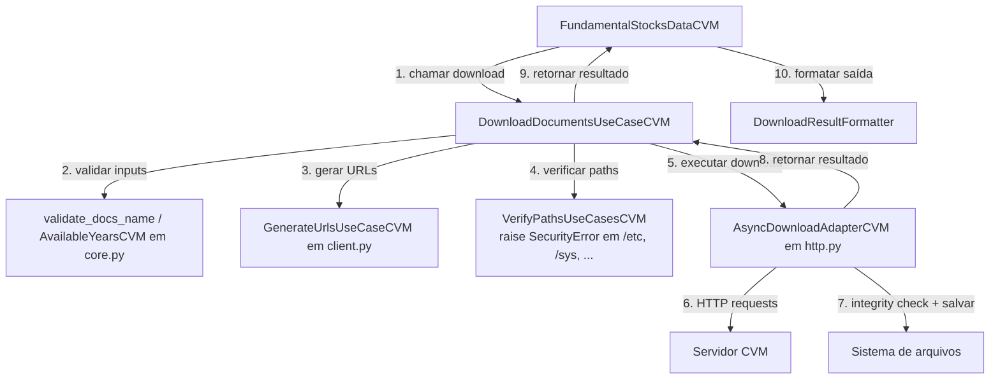
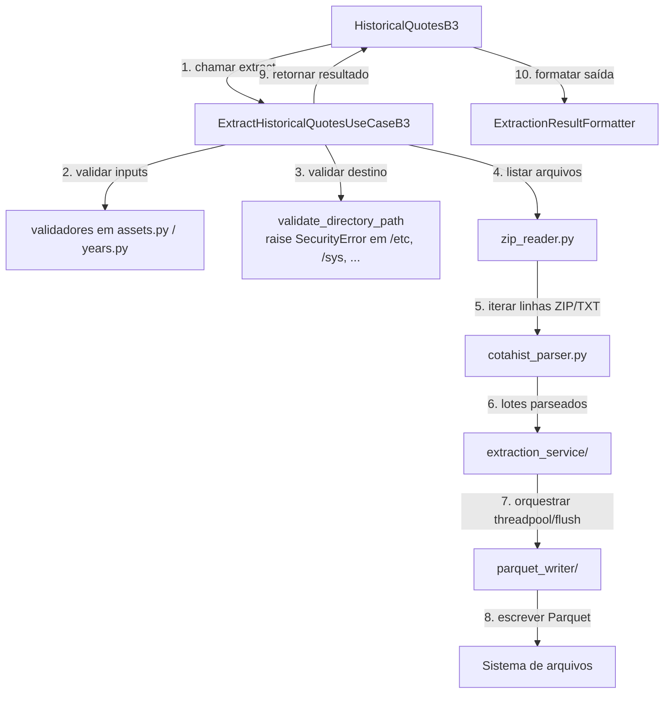

# Arquitetura

Documentação completa da arquitetura do Global-Data-Finance, padrões de design e estrutura do projeto.

______________________________________________________________________

## Visão Geral

Global-Data-Finance é uma biblioteca Python cuja API pública é deliberadamente
estreita — exportando na raiz as classes `FundamentalStocksDataCVM` e
`HistoricalQuotesB3`, além do contrato `ExtractionResultB3`. As fontes
implementadas atualmente são os feeds regulatórios brasileiros da CVM e os
dados históricos de mercado da B3. Internamente, cada fonte fica em sua pasta
de feature, com módulos focados e subpacotes especializados quando o domínio
exige.

Esta abordagem privilegia:

- ✅ **Leitura**: poucos arquivos com nomes claros (CVM: `core.py`, `client.py`, `http.py`, `extract.py`, `errors.py`; B3: módulos por papel — `client.py`, `assets.py`, `models.py`, `years.py`, `processing.py`, `filesystem.py`, `errors.py`, mais subpacotes pesados)
- ✅ **Manutenibilidade**: estrutura limpa, concisa e orientada de forma pragmática às funcionalidades dos módulos
- ✅ **Extensibilidade**: adicionar uma nova fonte suportada significa definir módulos da própria fonte e uma facade pública adequados às suas responsabilidades, reutilizando os limites da CVM ou da B3 quando fizer sentido
- ✅ **Testabilidade**: uso de duck typing direto e injeção de dependência para isolar e testar componentes de forma simples

______________________________________________________________________

## Estrutura do Projeto

```text
globaldatafinance/
├── src/globaldatafinance/
│   ├── __init__.py                  # re-exporta a API pública
│   ├── application/                 # FACADE PÚBLICO (top-level)
│   │   ├── b3_docs/
│   │   │   ├── historical_quotes.py            # HistoricalQuotesB3
│   │   │   ├── extraction_result_formatter.py
│   │   │   └── result_formatters/
│   │   └── cvm_docs/
│   │       ├── fundamental_stocks_data.py      # FundamentalStocksDataCVM
│   │       └── download_result_formatter.py
│   ├── brazil/                      # IMPLEMENTAÇÕES POR FONTE
│   │   ├── b3_data/
│   │   │   └── historical_quotes/   # módulos por papel + subpacotes pesados
│   │   │       ├── client.py                  # ExtractHistoricalQuotesUseCaseB3 + funções de orquestração
│   │   │       ├── assets.py                  # AvailableAssetsServiceB3 (validação + TPMERC mapping)
│   │   │       ├── models.py                  # DocsToExtractorB3 (dataclass)
│   │   │       ├── years.py                   # YearRangeB3 (value object + validators)
│   │   │       ├── processing.py              # ProcessingModeEnumB3, _ProcessingModeConfig
│   │   │       ├── filesystem.py              # FileSystemServiceB3.validate_directory_path
│   │   │       ├── errors.py                  # exceções específicas da fonte
│   │   │       ├── zip_reader.py              # leitura de COTAHIST ZIP/TXT
│   │   │       ├── catalog.py                 # catálogo caller-owned e validação estrita
│   │   │       ├── cotahist_parser.py         # parser posicional (preservado isolado)
│   │   │       ├── parquet_writer/            # subpacote: writer Parquet
│   │   │       └── extraction_service/        # subpacote: orquestração streaming/threadpool
│   │   └── cvm/
│   │       └── fundamental_stocks_data/   # módulos focados por responsabilidade
│   │           ├── core.py                    # AvailableYearsCVM, AvailableYearsInfoCVM, DictZipsToDownloadCVM, DownloadResultCVM, validate_docs_name
│   │           ├── client.py                  # consultas públicas, orquestração e validação de destino
│   │           ├── http.py                    # AsyncDownloadAdapterCVM (httpx async + retry + integrity)
│   │           ├── extract.py                 # ParquetExtractorAdapterCVM
│   │           ├── transaction.py             # commit em lote CVM tolerante a falhas
│   │           ├── csv_pipeline/              # inferência global CSV + escrita Arrow
│   │           ├── download_paths.py           # basename seguro derivado de URL
│   │           ├── download_validation.py     # validate_downloaded_file, validate_parquet_files, find_parquet_files
│   │           ├── download_extraction.py     # extract_downloaded_file (orquestra adapter + validation)
│   │           └── errors.py                  # exceções específicas da fonte
│   ├── core/                        # configuração, segurança de ZIP/path e utilidades
│   ├── macro_infra/                 # adapters e publicação genérica compartilhada
│   └── macro_exceptions/            # exceções de base do projeto
├── tests/                           # pytest, mirror por fonte
├── docs/                            # MkDocs
└── pyproject.toml
```

______________________________________________________________________

## Padrão de módulos por fonte

A entrada B3 segue o padrão externo `COTAHIST_A{YYYY}.ZIP` ou `.TXT`; o leitor
faz streaming do TXT interno ao ZIP ou do TXT descompactado. O membro interno
aceita o layout moderno `COTAHIST_A{YYYY}.TXT`, o histórico `COTAHIST.A{YYYY}`
e o histórico sem extensão `COTAHIST_A{YYYY}`, exigindo correspondência com o
ano externo.

CVM e B3 são as implementações de fonte atuais: CVM pertence a
`brazil/cvm/fundamental_stocks_data/` e B3 pertence a
`brazil/b3_data/historical_quotes/`. A organização segue as responsabilidades
reais, sem prometer que toda fonte futura terá exatamente o mesmo conjunto de
arquivos. Uma nova fonte pode reutilizar esses limites quando fizer sentido.

| Papel                       | CVM                                                | B3                                                                                     |
| --------------------------- | -------------------------------------------------- | -------------------------------------------------------------------------------------- |
| Dados puros (types, enums)  | `core.py`                                          | `models.py` + `years.py` + `processing.py`                                             |
| Validação / domain services | `core.py` (`validate_docs_name`)                   | `assets.py` (`AvailableAssetsServiceB3`) + `filesystem.py` (`validate_directory_path`) |
| Orquestração / use cases    | `client.py`                                        | `client.py`                                                                            |
| HTTP / download             | `http.py` (`AsyncDownloadAdapterCVM`)              | (no `zip_reader.py` + `extraction_service/`; não há download HTTP)                     |
| Extração / escrita Parquet  | `csv_pipeline/` + `transaction.py`                 | `parquet_writer/` + `extraction_service/`                                               |
| Parser de formato           | —                                                  | `cotahist_parser.py`                                                                   |
| Catálogo de inputs          | —                                                  | `catalog.py`                                                                           |
| Helpers de validação        | `download_paths.py`, `download_validation.py`, `download_extraction.py` | embutidos em `filesystem.py` / `client.py`                                             |
| Exceções                    | `errors.py`                                        | `errors.py`                                                                            |

### Segurança compartilhada e commits de fonte

`core/archive_safety.py` possui a política genérica de ZIP usada por ambas as
fontes: limites configuráveis, validação do central directory e contagem dos
bytes efetivamente descompactados. `core/utils/path_safety.py` valida o
destino fornecido pelo chamador antes de criar diretórios. As regras de nomes
permanecem nos owners: CSV e nomes derivados de URL na CVM e COTAHIST na B3.
`core/archive_names.py` expõe o validador neutro de basename portátil usado
tanto pela fronteira de ZIP quanto pelo fluxo de URL da CVM; cada owner traduz
o `ValueError` para sua própria exceção de diagnóstico.

`macro_infra/transactional_publication/` é a infraestrutura compartilhada e
não conhece schema ou regras de fonte. Ela mantém staging no mesmo filesystem,
manifesto durável, lock, backups e recuperação. CVM a usa para publicar os
múltiplos Parquets do ZIP; B3 a usa depois do merge dos artefatos por fonte.
Os owners continuam responsáveis por parser, schema e validação. O resultado é
um **commit em lote tolerante a falhas**, recuperável em caso de erro, e não uma
troca instantaneamente atômica de um diretório caller-owned.

Funções/classes auxiliares são internas ao módulo a menos que sejam usadas em outro arquivo — o ponto de extensibilidade real é a fonte, não o "tipo de objeto".

> **Por que B3 não tem `core.py` consolidado.** O conteúdo de B3 vive em módulos por tópico (`assets.py`, `models.py`, `years.py`, `processing.py`, `filesystem.py`) em vez de um único `core.py` porque cada um já tem massa crítica (~100–300 linhas) e diferentes consumidores. Consolidar trocaria 5 arquivos médios por 1 arquivo enorme.

______________________________________________________________________

## Camadas e responsabilidades observáveis

O repositório possui uma fronteira pública de aplicação, pacotes de
implementação por fonte e infraestrutura compartilhada. Dentro desses limites,
clients e use cases orquestram o trabalho, adapters possuem o I/O de HTTP,
filesystem e extração, módulos focados possuem validação e transformação, e os
módulos `*_formatter.py` possuem a apresentação no console.

### 1. Facade público (`application/`)

**Responsabilidade**: superfície semver-relevante para usuários da biblioteca.

```python
# src/globaldatafinance/application/cvm_docs/fundamental_stocks_data.py
from ...brazil.cvm.fundamental_stocks_data import (
    AsyncDownloadAdapterCVM,
    DownloadDocumentsUseCaseCVM,
    DownloadResultCVM,
    ParquetExtractorAdapterCVM,
    # ...
)


class FundamentalStocksDataCVM:
    def __init__(self):
        self.download_adapter = AsyncDownloadAdapterCVM(...)
        self.__download_use_case = DownloadDocumentsUseCaseCVM(
            self.download_adapter
        )

    def download(
        self,
        destination_path,
        list_docs=None,
        initial_year=None,
        last_year=None,
    ):
        result = self.__download_use_case.execute(
            destination_path=destination_path,
            list_docs=list_docs,
            initial_year=initial_year,
            last_year=last_year,
        )
        self.__result_formatter.print_result(result)
        return result
```

O facade importa **diretamente** dos módulos da própria fonte (sem passar por re-exports intermediários em `brazil/__init__.py`).

### 2. Implementação por fonte

As fontes atuais são `brazil/cvm/fundamental_stocks_data/` e
`brazil/b3_data/historical_quotes/`. A CVM é organizada em módulos focados; a
B3 também usa `extraction_service/` e `parquet_writer/` para orquestração
streaming e saída Parquet. Exemplo CVM:

```python
# src/globaldatafinance/brazil/cvm/fundamental_stocks_data/core.py
def validate_docs_name(docs_name: str) -> None:
    if not isinstance(docs_name, str):
        raise InvalidDocumentType(docs_name)

    key = docs_name.strip().upper()
    if key not in _DICT_AVAILABLE_DOCS:
        raise InvalidDocumentName(docs_name, list(_DICT_AVAILABLE_DOCS))
```

```python
# src/globaldatafinance/brazil/cvm/fundamental_stocks_data/client.py
class DownloadDocumentsUseCaseCVM:
    def __init__(self, repository: AsyncDownloadAdapterCVM) -> None:
        self.__repository: AsyncDownloadAdapterCVM = repository
        # ...

    def execute(
        self,
        destination_path,
        list_docs=None,
        initial_year=None,
        last_year=None,
    ) -> DownloadResultCVM:
        start_time = time.time()
        # ... orquestração ...
        result = self.__repository.download_docs(tasks)
        result.elapsed_time = time.time() - start_time
        return result
```

```python
# src/globaldatafinance/brazil/cvm/fundamental_stocks_data/http.py
class AsyncDownloadAdapterCVM:
    def download_docs(self, tasks) -> DownloadResultCVM:
        # implementação concreta com httpx async, retry e validação de
        # path/tamanho/ZIP legível
        ...
```

O orquestrador interage com `AsyncDownloadAdapterCVM` através do seu contrato
observável de métodos, permitindo que os testes utilizem stubs de duck typing
simples sem complexidade adicional (ver "Testes" mais abaixo). A verificação
por checksum MD5 é uma capacidade planejada e não faz parte do contrato atual
de download.

______________________________________________________________________

## Padrões de design

### Função (ou classe leve) por operação em `client.py`

A maioria das operações é modelada como função de módulo ou classe objetiva focada na sua responsabilidade específica, acionada diretamente pelo facade. Classes são utilizadas principalmente quando há **estado real reutilizável**: por exemplo, `ExtractHistoricalQuotesUseCaseB3` segura `zip_reader + parser + writer + processing_mode` entre chamadas e por isso permanece como classe.

```python
# Função simples em client.py
def generate_range_years(
    initial_year: int | None, last_year: int | None
) -> list[int]: ...


# Classe com estado real
class ExtractHistoricalQuotesUseCaseB3:
    def __init__(self, zip_reader, parser, writer, processing_mode): ...
    def execute(self, paths_of_docs, docs_to_extract): ...
```

### Adapters concretos e diretos

Os adapters responsáveis por I/O, como `AsyncDownloadAdapterCVM` e `ParquetExtractorAdapterCVM`, são importados e instanciados diretamente nos fluxos principais, garantindo rastreabilidade e simplicidade na navegação da base de código.

### Result objects

Operações que podem falhar parcialmente retornam objetos de resultado com
sucessos e erros explícitos, em vez de interromper tudo com `raise` em uma falha
parcial: a CVM usa o dataclass `DownloadResultCVM`, enquanto a facade B3
retorna o `TypedDict` público `ExtractionResultB3`.

```python
@dataclass
class DownloadResultCVM:
    success_count_downloads: int
    error_count_downloads: int
    successful_downloads: list[str]
    failed_downloads: dict[str, str]
    elapsed_time: float

    def has_errors(self) -> bool:
        return self.error_count_downloads > 0
```

### Objetos de dados e value objects

Objetos de dados e value objects focados encapsulam requests validados e limites
de anos (`AvailableYearsInfoCVM`, `DocsToExtractorB3` e o modelo de anos da B3).

### Separação de apresentação

Saída de console/log de apresentação fica em módulos `*_formatter.py` dentro de `application/`. Código de `client.py` permanece I/O-free (exceto pelas chamadas a adapters concretos).

### Defesa de path-traversal preservada como contrato

`VerifyPathsUseCasesCVM` (CVM, em `client.py`) e o helper `FileSystemServiceB3` (B3, em `filesystem.py`) levantam `SecurityError` antes de qualquer `mkdir`, bloqueando escrita em `/etc /sys /proc /dev /boot /root`. Esses helpers fazem parte do contrato observável de `FundamentalStocksDataCVM.download(destination_path=...)` e `HistoricalQuotesB3.extract(path_of_docs=...)` — devem permanecer bit-idênticos em qualquer refactor que mova o código.

______________________________________________________________________

## Fluxo de dados

### Download de documentos CVM



### Extração de cotações B3



______________________________________________________________________

## Como adicionar uma nova fonte

O exemplo abaixo é apenas uma **possibilidade arquitetural futura**; uma fonte
SEC dos EUA não é implementada pelo runtime atual. Quando uma nova fonte
regulatória ou de bolsa for aceita, crie uma pasta de implementação com módulos
adequados às suas responsabilidades. Para fontes pequenas, o padrão compacto
da CVM é um bom ponto de partida; para fontes complexas, a composição granular
da B3 ajuda a separar os tópicos antes que um módulo fique grande demais.

```text
src/globaldatafinance/usa/sec/fundamental_data/
├── core.py        # entidades, value objects, validadores  (consolide se ≤ ~300 linhas)
├── client.py      # use cases / orquestradores
├── http.py        # adapter HTTP concreto
├── extract.py     # adapter de extração concreto (se aplicável)
└── errors.py      # exceções específicas
```

Em seguida:

1. **Re-export interno**: adicione `__init__.py` na pasta da fonte (ou deixe vazio se não houver consumidores internos).

2. **Facade público**: crie `src/globaldatafinance/application/sec_docs/fundamental_data.py` com uma classe `FundamentalDataSEC` que importa diretamente dos módulos da própria fonte:

   ```python
   from ...usa.sec.fundamental_data import (
       DownloadAdapterSEC,
       DownloadDocumentsUseCaseSEC,
       # ...
   )
   ```

3. **API pública**: re-exporte a nova classe em `src/globaldatafinance/__init__.py` e `src/globaldatafinance/application/__init__.py`. Trate como adição **semver-relevante**.

4. **Testes**: crie `tests/usa/sec/fundamental_data/` espelhando módulos por tópico (não por camada). Tests devem importar dos módulos da própria fonte.

5. **Docs**: atualize `AGENTS.md` (Repository Map / Architecture Map) e este arquivo. Adicione referência em `docs/reference/`.

______________________________________________________________________

## Testes

A árvore de testes espelha as fontes:

```text
tests/
├── brazil/
│   ├── cvm/fundamental_stocks_data/
│   │   ├── application/use_cases/    # tests por tópico (organizacional, não camada)
│   │   ├── domain/                   # tests de value objects, validators (core.py)
│   │   ├── infra/adapters/           # tests de adapters concretos (http.py, extract.py)
│   │   ├── exceptions/               # tests das exceções (errors.py)
│   │   └── integration/              # tests integration-marker
│   └── b3_data/historical_quotes/
│       ├── test_*.py                  # tópicos de domínio e facade de uso
│       ├── extraction_service/        # serviço, parser, recursos e merge
│       ├── parquet_writer/            # escrita e streaming Parquet
│       └── integration/               # COTAHIST local opt-in
└── application/
    ├── cvm_docs/   # tests do facade público
    └── b3_docs/
        └── result_formatters/
```

Os subdiretórios de testes são organizacionais e orientados pelo formato da
fonte; não criam camadas de runtime. B3 separa o serviço de extração, o writer
Parquet e a integração local porque esses tópicos têm contratos e custos
operacionais diferentes. A integração determinística usa arquivos criados no
teste; a integração `real_data` usa apenas COTAHIST caller-owned e é opt-in.

### Estratégias de Mock e Stub

Para testar orquestradores e adapters de forma limpa e isolada, os testes substituem as dependências através de:

- **Stub duck-typed**: classes simples focadas nos métodos consumidos no teste, mantendo alta flexibilidade.
- **`monkeypatch.setattr`**: patcheia o método do adapter real.
- **`httpx.MockTransport`**: para tests do adapter HTTP que precisam respostas determinísticas sem rede.

Exemplo (duck typing):

```python
from globaldatafinance.brazil.cvm.fundamental_stocks_data.client import (
    DownloadDocumentsUseCaseCVM,
)
from globaldatafinance.brazil.cvm.fundamental_stocks_data.core import (
    DownloadResultCVM,
)
from globaldatafinance.brazil.cvm.fundamental_stocks_data.http import (
    DownloadTaskCVM,
)


class MockRepository:
    def download_docs(
        self,
        tasks: list[DownloadTaskCVM],
        *,
        automatic_extractor: bool | None = None,
    ) -> DownloadResultCVM:
        return DownloadResultCVM(
            successful_downloads=['DFP_2023', 'ITR_2023'],
            failed_downloads={},
            elapsed_time=0.5,
        )


use_case = DownloadDocumentsUseCaseCVM(MockRepository())
result = use_case.execute(destination_path='/tmp/cvm')
assert result.success_count_downloads == 2
```

Coverage é validado por capability: `tests/brazil/<source>/` + `tests/application/<facade>/` cobrem cada fonte como unidade isolada.

______________________________________________________________________

## Próximos Passos

- 📖 **[Referência da API](api-reference.md)** — Documentação completa da API
- 🤝 **[Como Contribuir](contributing.md)** — Guia para contribuidores
- 🧪 **[Testes](testing.md)** — Como escrever e executar testes
- 🔧 **[Uso Avançado](advanced-usage.md)** — Customização e extensões
