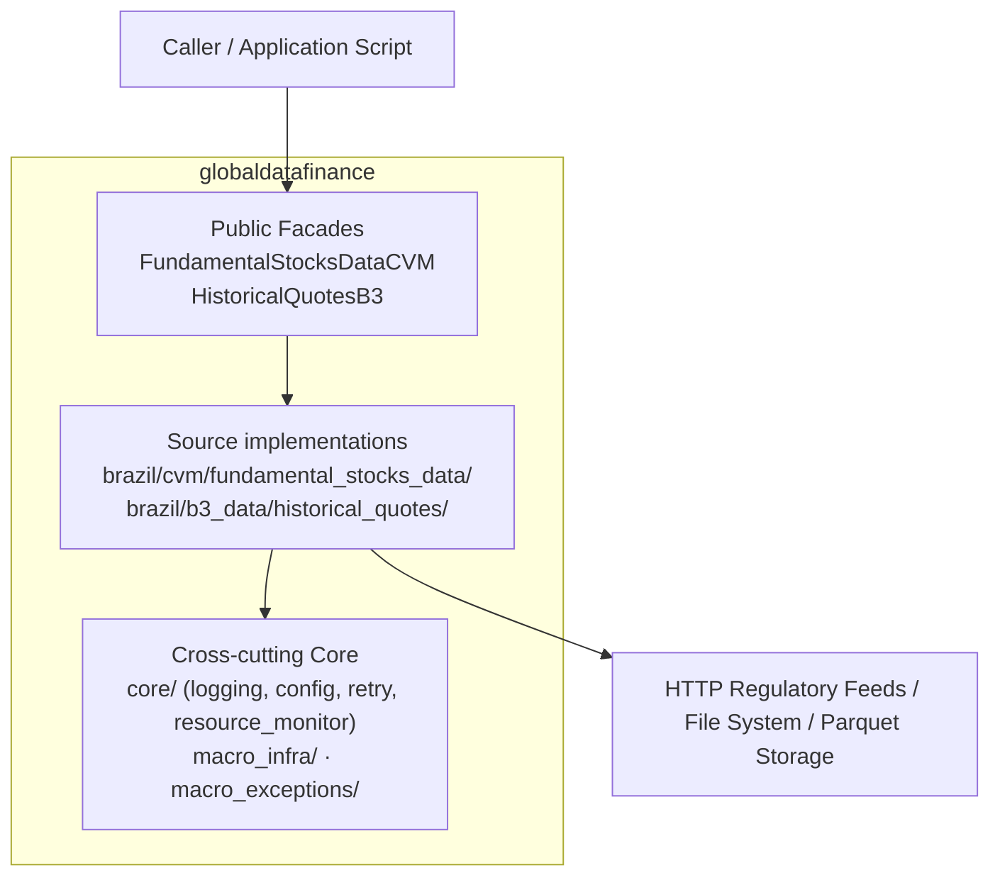

# 📊 Global-Data-Finance

> Python library for extracting, normalizing, and persisting Brazilian regulatory and market data in Parquet.

[](https://www.python.org/downloads/)
[](https://pypi.org/project/globaldatafinance/)
[](https://github.com/jordanestralioto/Global-Data-Finance/blob/develop/LICENSE)
[](http://mypy-lang.org/)

______________________________________________________________________

## 🎯 What Does This Library Offer?

**Global-Data-Finance** is a Python library designed to extract and process financial data in a professional and scalable manner:

✅ **Current data sources**: Brazilian CVM regulatory filings and B3 historical market quotes.
✅ **Optimized processing**: Asynchronous downloads (`httpx[http2]`) with adaptive concurrency monitored by CPU and memory.
✅ **Efficient format**: Native Parquet extraction through PyArrow.
✅ **Integrated robustness**: Retries with exponential back-off, data integrity validation, and a failure-atomic CVM batch commit.
✅ **Clear source ownership**: Source-specific modules remain under the CVM and B3 feature directories, while generic concerns live in `core/`, `macro_infra/`, and `macro_exceptions/`.

Current downloaded-file checks cover path safety, expected size, and readable
ZIP contents. MD5 checksum support is **Planned** and is not implemented.

______________________________________________________________________

## 🚀 Quick Start

### Installation

```bash
# As a library dependency via PyPI
pip install globaldatafinance

# For local development (uv is the canonical package manager for this repository)
git clone https://github.com/jordanestralioto/Global-Data-Finance.git
cd Global-Data-Finance
uv sync --locked --all-extras --dev
```

### Configuration

```bash
# Requires Python >=3.12,<4.0
python --version

# Optional: configure logging to view detailed progress
export DATAFIN_LOG_LEVEL=INFO
```

### Your First Download in 3 Lines

```python
from globaldatafinance import FundamentalStocksDataCVM

cvm = FundamentalStocksDataCVM()
cvm.download(
    destination_path="./data_cvm",
    list_docs=["DFP"],
    initial_year=2023,
    automatic_extractor=True
)
```

______________________________________________________________________

## ✨ Key Features

### 📈 Multiple Data Sources

```python
# CVM - Regulatory Documents (DFP, ITR, FRE, FCA, etc.)
from globaldatafinance import FundamentalStocksDataCVM

cvm = FundamentalStocksDataCVM()
cvm.download(
    destination_path="./data_cvm",
    list_docs=["DFP", "ITR"],
    initial_year=2023,
    last_year=2024,
    automatic_extractor=True
)

# B3 - Historical Quotes (stocks, ETFs, options, term, forward, auctions)
# The extractor accepts local COTAHIST_A{YYYY}.ZIP or COTAHIST_A{YYYY}.TXT inputs;
# ZIP takes precedence for one year.

from globaldatafinance import HistoricalQuotesB3

b3 = HistoricalQuotesB3()
result = b3.extract(
    path_of_docs="./raw_b3_data",
    destination_path="./processed_data",
    assets_list=["ações", "etf"],
    initial_year=2023,
    processing_mode="fast"
)
```

### 🔧 Intelligent Processing

The library offers distinct processing modes to optimize resource utilization:

```python
from globaldatafinance import HistoricalQuotesB3

b3 = HistoricalQuotesB3()

# FAST Mode - High-performance processing
result_fast = b3.extract(
    path_of_docs="./data",
    assets_list=["ações"],
    processing_mode="fast",  # Recommended default
)

# SLOW Mode - Memory-constrained processing
result_slow = b3.extract(
    path_of_docs="./data",
    assets_list=["ações"],
    processing_mode="slow",  # Recommended for low-memory environments
)
```

**Supported Asset Types (B3):**

- `ações` - Spot market and fractional shares
- `etf` - Exchange Traded Funds
- `opções` - Calls and Puts options
- `termo` - Term-market contracts
- `exercicio_opcoes` - Options exercise
- `forward` - Forward contracts
- `leilao` - Auction market

BDRs and Futures are **Planned** and are not accepted by the current runtime
contract. The Portuguese strings above are canonical API values and must be
passed exactly as shown. Planned features must not be passed to the public API.

**Checking available assets:**

```python
b3 = HistoricalQuotesB3()
available_assets = b3.get_available_assets()
print(f"Supported assets: {available_assets}")
```

### 📊 Available CVM Documents

```python
cvm = FundamentalStocksDataCVM()

# Check available document types
docs = cvm.get_available_docs()
for doc_type, description in docs.items():
    print(f"{doc_type}: {description}")

# Check available year range
years = cvm.get_available_years()
print(f"Available years: {years.general_min_year} - {years.current_year}")
```

**Supported Documents:**

- `DFP` - Standardized Financial Statements (annual)
- `ITR` - Quarterly Financial Statements
- `FRE` - Reference Form (detailed company filings)
- `FCA` - Cadastral Form (corporate registry info)
- `CGVN` - Governance Communication
- `VLMO` - Securities Holding Declaration
- `IPE` - Periodic and Eventual Information (material facts, notices)

### 💾 Data Analysis Ready

```python
import pandas as pd

# Read processed data (Parquet format)
df_quotes = pd.read_parquet("./processed_data/cotahist_extracted.parquet")

# Basic dataframe check
print(df_quotes.head())
print(df_quotes.info())

# Mean closing price analysis by asset ticker
mean_prices = df_quotes.groupby("ticker")["preco_fechamento"].mean()
print(mean_prices.sort_values(ascending=False).head(10))
```

### ⚙️ Advanced Configuration

```python
import logging

# Configure structured logging level
logging.basicConfig(
    level=logging.INFO,
    format='%(asctime)s - %(name)s - %(levelname)s - %(message)s'
)

# Download with custom configurations
cvm = FundamentalStocksDataCVM()
cvm.download(
    destination_path="./data_cvm",
    list_docs=["DFP", "ITR", "FRE"],
    initial_year=2020,
    last_year=2024,
    automatic_extractor=True  # Automatically converts ZIP files to Parquet
)
```

______________________________________________________________________

## 📚 Documentation

### User Guide

- **[Installation](user-guide/installation.md)** - Step-by-step environment setup
- **[Quick Start](user-guide/quickstart.md)** - Learn core functionality
- **[CVM Documents](user-guide/cvm-docs.md)** - Comprehensive guide to Brazilian regulatory financial filings
- **[B3 Quotes](user-guide/b3-docs.md)** - Complete guide to B3 market exchange data
- **[Practical Examples](user-guide/examples.md)** - Real-world operational scripts and data workflows
- **[FAQ](user-guide/faq.md)** - Frequently asked questions and troubleshooting

### Developer Guide

- **[Architecture](dev-guide/architecture.md)** - Source ownership and architectural design decisions
- **[API Reference](dev-guide/api-reference.md)** - Full structural reference of public boundaries
- **[Contributing](dev-guide/contributing.md)** - Contribution guidelines and validation practices
- **[Testing](dev-guide/testing.md)** - Test suites, markers, and coverage gate strategy
- **[Benchmarks](dev-guide/benchmarks.md)** - Reproducible time, memory, and volume measurements
- **[Technical Decisions](decisions/test-execution-tiers.md)** - Test execution tiers and local COTAHIST validation contract
- **[Advanced Usage](dev-guide/advanced-usage.md)** - Optimization patterns and programmatic customization
- **[Logging System](dev-guide/logging-system.md)** - Structured log formatting and diagnostic setup
- **[Resource Monitoring](dev-guide/resource-monitoring.md)** - Adaptive memory and CPU resource throttling
- **[Retry Strategy](dev-guide/retry-strategy.md)** - Asynchronous network resilience and exponential backoff

### Technical Reference

- **[CVM API](reference/cvm-api.md)** - Precise classes and return contracts for CVM extraction
- **[B3 API](reference/b3-api.md)** - Precise classes and return contracts for B3 processing
- **[Exceptions](reference/exceptions.md)** - Hierarchy of custom project exceptions and error handling

______________________________________________________________________

## 🏗️ Why Use This Library?

### For Enterprises

- ✅ **Performance**: Asynchronous concurrent downloads up to 10x faster than linear polling
- ✅ **Reliability**: Fault-tolerant retry mechanisms with exponential backoff and integrity checks
- ✅ **Observability**: Transparent diagnostic logging and real-time system resource tracking
- ✅ **Scalability**: Designed to handle multi-year historical market data volumes effortlessly

### For Developers

- ✅ **Source-Oriented Layout**: Role-named modules and specialized packages make the implementation intuitive to navigate, debug, and audit
- ✅ **Extensible Design**: Adding a new supported source can follow the existing source-ownership and role-based module boundaries
- ✅ **Type Safety**: TypedDict contracts and type annotations checked with `mypy`
- ✅ **Automated CI/CD**: Enforced GitHub Actions quality gates (`ruff`, `mypy`, and `pytest --cov=85%`)

### For Analysts & Data Scientists

- ✅ **Parquet Output**: Columnar storage optimized for Pandas and PyArrow consumers
- ✅ **Intuitive API**: Direct, semantic public methods with minimal boilerplate
- ✅ **Normalized Data**: Automated parsing, normalization, and validation of positional files and ZIP bundles
- ✅ **Rich Documentation**: Executable onboarding scripts, operational examples, and comprehensive tutorials

______________________________________________________________________

## 📊 Architecture Overview

1. **Public facades and application layer (`application/`)** — SemVer-sensitive boundary consumed by calling applications and pipelines, including console formatters.
2. **Source implementations** — CVM is under `brazil/cvm/fundamental_stocks_data/` and B3 is under `brazil/b3_data/historical_quotes/`. Clients and use cases orchestrate work, adapters own I/O, and focused modules own validation, parsing, and transformation.
3. **Shared infrastructure** — `core/` owns configuration, logging, path safety, retries, progress, and resource monitoring; `macro_infra/` owns generic HTTP/file adapters; `macro_exceptions/` owns project exception bases.



**Key Architectural Benefits:**

- **Direct Readability**: Minimal abstraction layers and cohesive, responsibility-named modules keep the execution path crystal clear.
- **Concrete Adapters**: Concrete I/O adapters are imported and instantiated directly, ensuring straightforward, traceable execution pathways without complex dependency injection containers.
- **Source-Oriented Extensibility**: A new supported financial feed can define source-owned modules and a public facade suited to its responsibilities, reusing existing boundaries where appropriate.
- **Strict Security Contracts**: Path-traversal defenses (`VerifyPathsUseCasesCVM` and B3 path validation) strictly raise `SecurityError` before creating directories or persisting data.

[Learn more about our design decisions in Architecture →](dev-guide/architecture.md)

______________________________________________________________________

## 🚀 Common Use Cases

### 1. Fundamental Financial Analysis

```python
from globaldatafinance import FundamentalStocksDataCVM
import pandas as pd

# Download annual standardized financial statements (DFP) and quarterly filings (ITR)
cvm = FundamentalStocksDataCVM()
cvm.download(
    destination_path="./fundamental_data",
    list_docs=["DFP", "ITR"],
    initial_year=2020,
    automatic_extractor=True
)

# Load extracted Parquet financial statements for analysis
df_balance = pd.read_parquet("./fundamental_data/dfp_cia_aberta_BPA_con_2023.parquet")
print(df_balance[df_balance['DS_CONTA'].str.contains('Ativo Total')])
```

### 2. Quantitative Strategy Backtesting

```python
from globaldatafinance import HistoricalQuotesB3
import pandas as pd

# Extract historical stock quotes from official B3 COTAHIST archives
b3 = HistoricalQuotesB3()
b3.extract(
    path_of_docs="./raw_b3_archives",
    destination_path="./market_quotes",
    assets_list=["ações"],
    initial_year=2020,
    processing_mode="fast"
)

# Load normalized quotes dataset
df = pd.read_parquet("./market_quotes/cotahist_extracted.parquet")
df['data_pregao'] = pd.to_datetime(df['data_pregao'])

# Calculate daily price returns per ticker
df['daily_return'] = df.groupby('ticker')['preco_fechamento'].pct_change()
```

### 3. Automated Data Ingestion Pipeline

```python
from globaldatafinance import FundamentalStocksDataCVM, HistoricalQuotesB3
import logging

logging.basicConfig(level=logging.INFO)

def financial_data_pipeline():
    """End-to-end automated financial data extraction pipeline."""

    # 1. Corporate regulatory filings (CVM)
    print("Ingesting CVM regulatory filings...")
    cvm = FundamentalStocksDataCVM()
    cvm.download(
        destination_path="./data/cvm",
        list_docs=["DFP", "ITR"],
        initial_year=2023,
        automatic_extractor=True
    )

    # 2. Historical market exchange quotes (B3)
    print("Processing B3 market historical quotes...")
    b3 = HistoricalQuotesB3()
    result = b3.extract(
        path_of_docs="./data/raw/b3",
        destination_path="./data/processed/b3",
        assets_list=["ações", "etf"],
        initial_year=2023,
        processing_mode="fast"
    )

    print(f"Pipeline execution finished successfully! Total consolidated records: {result['total_records']:,}")

if __name__ == "__main__":
    financial_data_pipeline()
```

______________________________________________________________________

## 🤝 Contributing

We welcome contributions! Whether adding a new supported source, refining parsers, or boosting throughput:

1. Fork the repository
2. Create your feature branch: `git checkout -b feature/new-source`
3. Implement features within the established source-ownership boundaries and security invariants
4. Execute test suites with coverage: `uv run --locked --no-sync pytest --cov`
5. Verify code quality gates: `uv run --locked --no-sync pre-commit run --all-files --show-diff-on-failure`
6. Submit a Pull Request with description and test evidence

[Read our Contribution Guide →](dev-guide/contributing.en.md)

For the quick entry point, see
[CONTRIBUTING.md in the repository](https://github.com/jordanestralioto/Global-Data-Finance/blob/develop/CONTRIBUTING.md).

______________________________________________________________________

## 📞 Support & Community

- 📧 **Email Contact**: estraliotojordan@gmail.com
- 🐛 **Issue Tracker**: [GitHub Issues](https://github.com/jordanestralioto/Global-Data-Finance/issues)
- 💬 **Discussions**: [GitHub Discussions](https://github.com/jordanestralioto/Global-Data-Finance/discussions)
- 🔒 **Security**: See the [Security Policy](https://github.com/jordanestralioto/Global-Data-Finance/blob/develop/SECURITY.md); do not disclose vulnerabilities in public issues.
- 🤝 **Community**: Follow the [Code of Conduct](https://github.com/jordanestralioto/Global-Data-Finance/blob/develop/CODE_OF_CONDUCT.md).
- 📖 **Documentation**: [https://jordanestralioto.github.io/Global-Data-Finance/](https://jordanestralioto.github.io/Global-Data-Finance/)

______________________________________________________________________

## 📄 License

Licensed under the Apache License, Version 2.0. Feel free to incorporate into personal, academic, and enterprise projects.

See the [LICENSE](https://github.com/jordanestralioto/Global-Data-Finance/blob/develop/LICENSE) file for complete details.

______________________________________________________________________

## 👨‍💻 Author

**Jordan Estralioto**

- GitHub: [@jordanestralioto](https://github.com/jordanestralioto)
- Email: estraliotojordan@gmail.com
- PyPI Package: [globaldatafinance](https://pypi.org/project/globaldatafinance/)

______________________________________________________________________

**Status:** The package distribution is **Beta** (`Development Status :: 4 - Beta`). The implemented CVM and B3 workflows are considered **Production** for their current contracts; planned capabilities remain unsupported.

<div align="center">
    <sub>Copyright © 2026 Jordan Estralioto • Licensed under Apache 2.0</sub>
</div>
