# 📊 Global-Data-Finance

> Biblioteca Python para extração, normalização e persistência em Parquet de dados regulatórios e de mercado brasileiros.

[](https://www.python.org/downloads/)
[](https://pypi.org/project/globaldatafinance/)
[](https://github.com/jordanestralioto/Global-Data-Finance/blob/develop/LICENSE)
[](http://mypy-lang.org/)

______________________________________________________________________

## 🎯 O que este sistema oferece?

**Global-Data-Finance** é uma biblioteca Python que permite extrair e processar dados financeiros de forma profissional e escalável:

✅ **Fontes atuais**: documentos regulatórios brasileiros da CVM e cotações históricas da B3
✅ **Processamento otimizado**: Downloads assíncronos (`httpx[http2]`) com concorrência adaptativa por CPU/RAM
✅ **Formato eficiente**: Extração nativa para Parquet com PyArrow
✅ **Robustez integrada**: Retries com back-off, validação de integridade e commit em lote CVM tolerante a falhas
✅ **Ownership claro por fonte**: módulos específicos permanecem nas pastas de CVM e B3, enquanto preocupações genéricas ficam em `core/`, `macro_infra/` e `macro_exceptions/`.

As verificações atuais de arquivos baixados cobrem segurança do path, tamanho
esperado e legibilidade do ZIP. O suporte a checksum MD5 é **Planned** e não
está implementado.

______________________________________________________________________

## 🚀 Início Rápido

### Instalação

```bash
# Como dependência via PyPI
pip install globaldatafinance

# Para desenvolvimento local (uv é o gestor canônico do projeto)
git clone https://github.com/jordanestralioto/Global-Data-Finance.git
cd Global-Data-Finance
uv sync --locked --all-extras --dev
```

### Configuração

```bash
# Requer Python >=3.12,<4.0
python --version

# Opcional: configurar logging para ver progresso detalhado
export DATAFIN_LOG_LEVEL=INFO
```

### Primeiro Download em 3 Linhas

```python
from globaldatafinance import FundamentalStocksDataCVM

cvm = FundamentalStocksDataCVM()
cvm.download(
    destination_path="./dados_cvm",
    list_docs=["DFP"],
    initial_year=2023,
    automatic_extractor=True
)
```

______________________________________________________________________

## ✨ Funcionalidades Principais

### 📈 Múltiplas Fontes de Dados

```python
# CVM - Documentos Regulatórios (DFP, ITR, FRE, FCA, etc.)
from globaldatafinance import FundamentalStocksDataCVM

cvm = FundamentalStocksDataCVM()
cvm.download(
    destination_path="./dados_cvm",
    list_docs=["DFP", "ITR"],
    initial_year=2023,
    last_year=2024,
    automatic_extractor=True
)

# B3 - Cotações Históricas (ações, ETFs, opções, termo, forward, leilões)
# O extrator aceita inputs locais COTAHIST_A{YYYY}.ZIP ou COTAHIST_A{YYYY}.TXT;
# ZIP prevalece no mesmo ano.

from globaldatafinance import HistoricalQuotesB3

b3 = HistoricalQuotesB3()
result = b3.extract(
    path_of_docs="./dados_brutos_b3",
    destination_path="./dados_processados",
    assets_list=["ações", "etf"],
    initial_year=2023,
    processing_mode="fast"
)
```

### 🔧 Processamento Inteligente

A biblioteca oferece diferentes modos de processamento para otimizar performance:

```python
from globaldatafinance import HistoricalQuotesB3

b3 = HistoricalQuotesB3()

# Modo FAST - Processamento de alto desempenho
result_fast = b3.extract(
    path_of_docs="./dados",
    assets_list=["ações"],
    processing_mode="fast",  # Padrão recomendado
)

# Modo SLOW - Processamento com menor uso de memória
result_slow = b3.extract(
    path_of_docs="./dados",
    assets_list=["ações"],
    processing_mode="slow",  # Para ambientes restritos
)
```

**Tipos de Ativos Suportados (B3):**

- `ações` - Mercado à vista e fracionário
- `etf` - Exchange Traded Funds
- `opções` - Calls e Puts
- `termo` - Mercado a termo
- `exercicio_opcoes` - Exercício de opções
- `forward` - Mercado forward
- `leilao` - Mercado de leilão

BDRs e Futures são **Planned** e não são aceitos pelo contrato atual do
runtime. As strings em português acima são valores canônicos da API e devem ser
passadas exatamente como mostradas. Funcionalidades planejadas não devem ser
passadas à API pública.

**Verificar ativos disponíveis:**

```python
b3 = HistoricalQuotesB3()
available_assets = b3.get_available_assets()
print(f"Ativos suportados: {available_assets}")
```

### 📊 Documentos CVM Disponíveis

```python
cvm = FundamentalStocksDataCVM()

# Ver documentos disponíveis
docs = cvm.get_available_docs()
for doc_type, description in docs.items():
    print(f"{doc_type}: {description}")

# Ver anos disponíveis
years = cvm.get_available_years()
print(f"Anos disponíveis: {years.general_min_year} - {years.current_year}")
```

**Documentos Suportados:**

- `DFP` - Demonstrações Financeiras Padronizadas (anual)
- `ITR` - Informações Trimestrais
- `FRE` - Formulário de Referência
- `FCA` - Formulário Cadastral
- `CGVN` - Comunicado de Governança
- `VLMO` - Valor Mobiliário
- `IPE` - Informações Periódicas e Eventuais

### 💾 Análise de Dados

Os exemplos com Pandas abaixo tratam a biblioteca como dependência downstream
opcional. Instale-a separadamente (`python -m pip install pandas`) se precisar
de DataFrames; o caminho padrão da biblioteca usa PyArrow.

```python
import pyarrow.parquet as pq

# Ler dados processados (formato Parquet)
table_cotacoes = pq.read_table(
    "./dados_processados/cotahist_extracted.parquet"
)

# Inspeção básica
print(table_cotacoes.slice(0, 5))

# Use table_cotacoes.to_batches() para processamento limitado por memória.
```

### ⚙️ Configurações Avançadas

```python
import logging

# Configurar nível de logging
logging.basicConfig(
    level=logging.INFO,
    format='%(asctime)s - %(name)s - %(levelname)s - %(message)s'
)

# Download com configurações customizadas
cvm = FundamentalStocksDataCVM()
cvm.download(
    destination_path="./dados_cvm",
    list_docs=["DFP", "ITR", "FRE"],
    initial_year=2020,
    last_year=2024,
    automatic_extractor=True  # Converte ZIP para Parquet automaticamente
)
```

______________________________________________________________________

## 📚 Documentação

### Para Usuários

- **[Instalação](user-guide/installation.md)** - Configure seu ambiente passo a passo
- **[Início Rápido](user-guide/quickstart.md)** - Aprenda os fundamentos
- **[Documentos CVM](user-guide/cvm-docs.md)** - Guia completo de dados regulatórios
- **[Cotações B3](user-guide/b3-docs.md)** - Guia completo de dados de mercado
- **[Exemplos Práticos](user-guide/examples.md)** - Casos de uso reais
- **[FAQ](user-guide/faq.md)** - Perguntas frequentes

### Para Desenvolvedores

- **[Arquitetura](dev-guide/architecture.md)** - Ownership por fonte e decisões de arquitetura
- **[Referência da API](dev-guide/api-reference.md)** - Documentação completa da API
- **[Como Contribuir](dev-guide/contributing.md)** - Guia de contribuição
- **[Testes](dev-guide/testing.md)** - Estratégias de teste e cobertura
- **[Benchmarks](dev-guide/benchmarks.md)** - Métricas reproduzíveis de tempo, memória e volume
- **[Decisões técnicas](decisions/test-execution-tiers.md)** - Contratos de execução, ingestão e fronteiras de infraestrutura
- **[Corte limpo da infraestrutura compartilhada](decisions/shared-infrastructure-clean-cut.md)** - Hard cut de adapters legados, Pandas e helpers invariantes
- **[Uso Avançado](dev-guide/advanced-usage.md)** - Técnicas avançadas e otimizações
- **[Sistema de Logging](dev-guide/logging-system.md)** - Configurações e práticas de logs estruturados
- **[Monitoramento de Recursos](dev-guide/resource-monitoring.md)** - Monitoramento adaptativo de CPU e memória
- **[Estratégia de Retry](dev-guide/retry-strategy.md)** - Resiliência assíncrona de rede e backoff exponencial

### Referência Técnica

- **[API CVM](reference/cvm-api.md)** - Referência completa da API CVM
- **[API B3](reference/b3-api.md)** - Referência completa da API B3
- **[Exceções](reference/exceptions.md)** - Tratamento de erros e exceções

______________________________________________________________________

## 🏗️ Por Que Usar Esta Biblioteca?

### Para Empresas

- ✅ **Performance**: Downloads paralelos assíncronos até 10x mais rápidos
- ✅ **Confiabilidade**: Sistema de retries com backoff exponencial
- ✅ **Monitoramento**: Logging detalhado e rastreamento de recursos
- ✅ **Escalabilidade**: Arquitetura preparada para grandes volumes de dados

### Para Desenvolvedores

- ✅ **Layout orientado por fonte**: módulos nomeados por papel e subpacotes especializados — código fácil de ler e auditar
- ✅ **Extensível**: Uma nova fonte suportada pode seguir os limites atuais de ownership e módulos por papel
- ✅ **Type hints**: Contratos `TypedDict` e anotações verificados com `mypy`
- ✅ **CI/CD**: Quality checks automáticos com GitHub Actions (`ruff`, `mypy`, `pytest --cov`)

### Para Analistas e Cientistas de Dados

- ✅ **Formato Parquet**: Dados otimizados para análise com Pandas ou PyArrow
- ✅ **API Intuitiva**: Interface simples e direta ao ponto
- ✅ **Dados Limpos**: Processamento e validação automática
- ✅ **Documentação Completa**: Exemplos práticos e casos de uso reais

______________________________________________________________________

## 📊 Arquitetura

1. **Facades públicas e camada application (`application/`)** — superfície semver-relevante para consumidores, incluindo os formatadores de console.
2. **Implementações por fonte** — CVM fica em `brazil/cvm/fundamental_stocks_data/` e B3 em `brazil/b3_data/historical_quotes/`. Clients e use cases orquestram o trabalho, adapters possuem o I/O e módulos focados possuem validação, parsing e transformação.
3. **Infraestrutura compartilhada** — `core/` possui configuração, logging, segurança de paths, retry, progresso e monitoramento; `macro_infra/` possui adapters genéricos de HTTP/arquivos; `macro_exceptions/` possui as exceções-base do projeto.

```mermaid
graph TD
    User[Usuário / Script] --> Facade

    subgraph "globaldatafinance"
        Facade["Facade<br/>FundamentalStocksDataCVM<br/>HistoricalQuotesB3"]
        Facade --> Source["Implementações por fonte<br/>brazil/cvm/fundamental_stocks_data/<br/>brazil/b3_data/historical_quotes/"]
        Source --> Cross["Cross-cutting<br/>core/ (logging, config, retry, resource_monitor)<br/>macro_infra/ · macro_exceptions/"]
    end

    Source --> External[Web / File System / Parquet]
```



**Benefícios:**

- **Leitura direta**: Poucos arquivos por fonte com nomes claros por responsabilidade, tornando o fluxo do código intuitivo.
- **Adapters concretos**: Adapters são importados e instanciados diretamente para manter a base de código simples e de fácil navegação.
- **Extensibilidade orientada a fontes**: Uma nova fonte suportada pode definir módulos próprios e uma facade pública adequada às suas responsabilidades, reutilizando limites existentes quando fizer sentido.
- **Defesa de path-traversal como contrato**: `VerifyPathsUseCasesCVM` e `validate_directory_path` (B3) levantam `SecurityError` antes de qualquer `mkdir`.

[Saiba mais sobre a arquitetura →](dev-guide/architecture.md)

______________________________________________________________________

## 🚀 Casos de Uso

### 1. Análise Fundamentalista

Os exemplos analíticos desta seção pressupõem a instalação opcional do Pandas:
`python -m pip install pandas`.

```python
from globaldatafinance import FundamentalStocksDataCVM
import pandas as pd

# Baixar demonstrações financeiras
cvm = FundamentalStocksDataCVM()
cvm.download(
    destination_path="./dados_fundamentalistas",
    list_docs=["DFP", "ITR"],
    initial_year=2020,
    automatic_extractor=True
)

# Analisar balanços patrimoniais
df_balanco = pd.read_parquet("./dados_fundamentalistas/dfp_cia_aberta_BPA_con_2023.parquet")
print(df_balanco[df_balanco['DS_CONTA'].str.contains('Ativo Total')])
```

### 2. Backtesting de Estratégias

```python
from globaldatafinance import HistoricalQuotesB3
import pandas as pd

# Extrair cotações históricas
b3 = HistoricalQuotesB3()
b3.extract(
    path_of_docs="./dados_brutos",
    destination_path="./cotacoes",
    assets_list=["ações"],
    initial_year=2020,
    processing_mode="fast"
)

# Carregar e analisar
df = pd.read_parquet("./cotacoes/cotahist_extracted.parquet")
df['data_pregao'] = pd.to_datetime(df['data_pregao'])

# Calcular retornos
df['retorno_diario'] = df.groupby('ticker')['preco_fechamento'].pct_change()
```

### 3. Pipeline de Dados Automatizado

```python
from globaldatafinance import FundamentalStocksDataCVM, HistoricalQuotesB3
import logging

logging.basicConfig(level=logging.INFO)

def pipeline_dados_financeiros():
    """Pipeline completo de extração de dados financeiros"""

    # 1. Dados fundamentalistas (CVM)
    print("Baixando dados CVM...")
    cvm = FundamentalStocksDataCVM()
    cvm.download(
        destination_path="./data/cvm",
        list_docs=["DFP", "ITR"],
        initial_year=2023,
        automatic_extractor=True
    )

    # 2. Cotações históricas (B3)
    print("Processando cotações B3...")
    b3 = HistoricalQuotesB3()
    result = b3.extract(
        path_of_docs="./data/raw/b3",
        destination_path="./data/processed/b3",
        assets_list=["ações", "etf"],
        initial_year=2023,
        processing_mode="fast"
    )

    print(f"Pipeline concluído! Total de registros: {result['total_records']:,}")

if __name__ == "__main__":
    pipeline_dados_financeiros()
```

______________________________________________________________________

## 🤝 Contribuindo

Quer adicionar uma nova fonte suportada ou melhorar a performance?

1. Fork o repositório
2. Crie uma branch: `git checkout -b feature/nova-feature`
3. Implemente seguindo os padrões existentes
4. Execute os testes: `uv run --locked --no-sync pytest --cov`
5. Execute os linters: `uv run --locked --no-sync pre-commit run --all-files --show-diff-on-failure`
6. Envie um Pull Request

[Guia completo de contribuição →](dev-guide/contributing.md)

Para o ponto de entrada rápido, consulte o
[CONTRIBUTING.md no repositório](https://github.com/jordanestralioto/Global-Data-Finance/blob/develop/CONTRIBUTING.md).

______________________________________________________________________

## 📞 Suporte

- 📧 **Email**: estraliotojordan@gmail.com
- 🐛 **Bugs**: [GitHub Issues](https://github.com/jordanestralioto/Global-Data-Finance/issues)
- 💬 **Discussões**: [GitHub Discussions](https://github.com/jordanestralioto/Global-Data-Finance/discussions)
- 🔒 **Segurança**: consulte a [Política de Segurança](https://github.com/jordanestralioto/Global-Data-Finance/blob/develop/SECURITY.md) e não publique vulnerabilidades em issues.
- 🤝 **Comunidade**: siga o [Código de Conduta](https://github.com/jordanestralioto/Global-Data-Finance/blob/develop/CODE_OF_CONDUCT.md).
- 📖 **Documentação**: [https://jordanestralioto.github.io/Global-Data-Finance/](https://jordanestralioto.github.io/Global-Data-Finance/)

______________________________________________________________________

## 📄 Licença

Apache 2.0 - Use livremente em seus projetos comerciais e pessoais.

Consulte o arquivo [LICENSE](https://github.com/jordanestralioto/Global-Data-Finance/blob/develop/LICENSE) para mais detalhes.

______________________________________________________________________

## 👨‍💻 Autor

**Jordan Estralioto**

- GitHub: [@jordanestralioto](https://github.com/jordanestralioto)
- Email: estraliotojordan@gmail.com
- PyPI: [globaldatafinance](https://pypi.org/project/globaldatafinance/)

______________________________________________________________________

**Status:** A distribuição do pacote está em **Beta** (`Development Status :: 4 - Beta`). Os fluxos CVM e B3 implementados são considerados **Production** dentro dos contratos atuais; capacidades planejadas continuam sem suporte.

<div align="center">
    <sub>Copyright © 2026 Jordan Estralioto • Licensed under Apache 2.0</sub>
</div>
